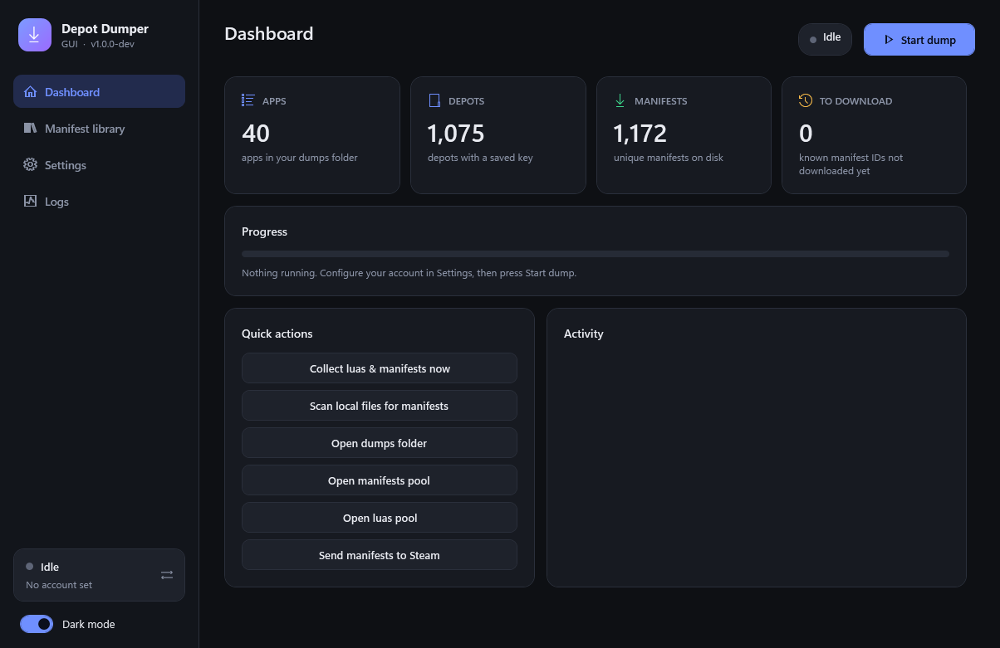
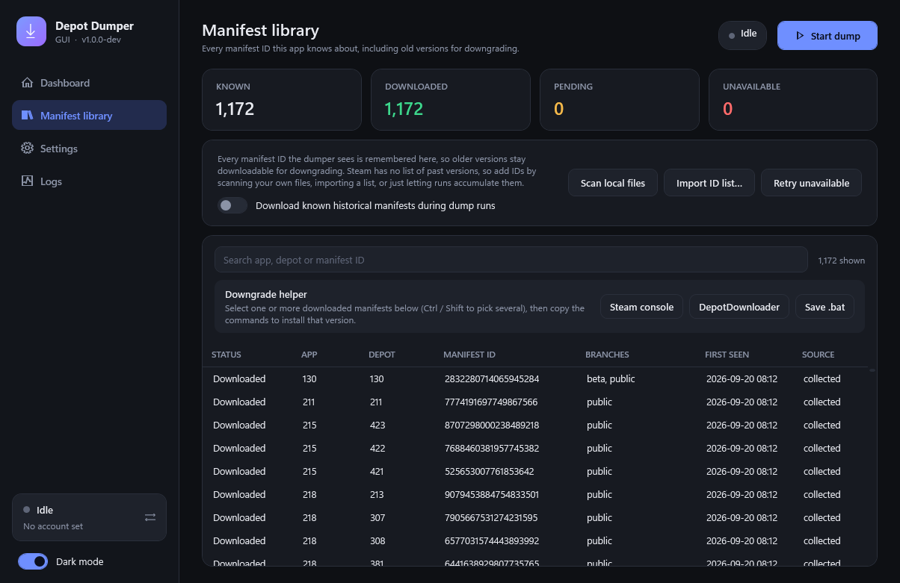
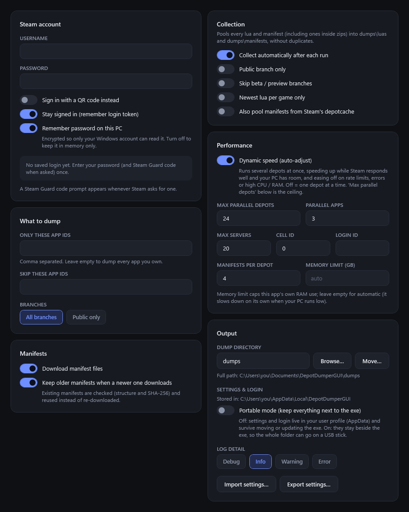
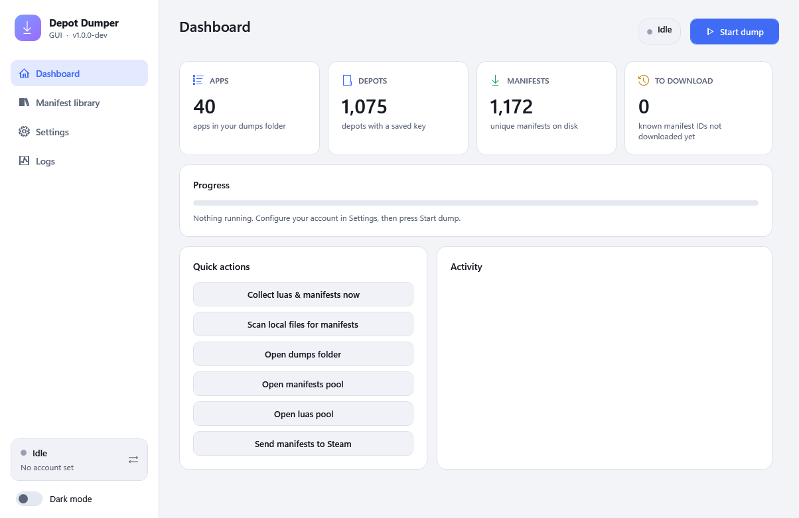
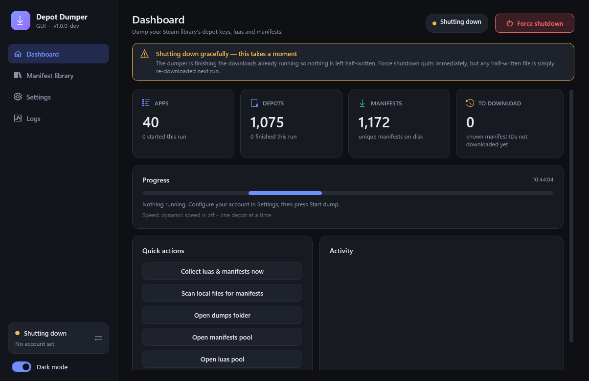

<div align="center">

# Depot Dumper GUI

**Dump the depot keys, luas and manifests for your whole Steam library, from a clean dark-mode desktop app.**

`Windows` · `.NET 9` · `Steam Guard codes, QR or token sign-in` · `keeps every manifest version`

</div>

<div align="center">



</div>

<details>
<summary>More screenshots</summary>

| Manifest library + downgrade helper | Settings |
|---|---|
|  |  |

| Light theme | Graceful shutdown |
|---|---|
|  |  |

</details>

---

## What it does

Depot Dumper GUI signs in to Steam with your account and, for every app you own (or just the ones you pick), collects:

| | |
|---|---|
| **Depot keys** | one `.key` file per app |
| **Manifests** | `DepotID_ManifestID.manifest` for every branch |
| **Luas** | an `AppID.lua` per branch with the app, depot keys and DLC |
| **Archives** | a dated `.zip` per app/branch, for safekeeping |
| **Reports** | HTML / CSV / JSON / TXT summaries of each run |

It is a GUI fork of the [Morrenus Edition of DepotDumper](https://github.com/MorrenusGames/DepotDumperMorrenusEdition), built on [SteamKit2](https://github.com/SteamRE/SteamKit). See [Credits](#credits) for the full fork history.

## Highlights

- **Easy sign-in.** Steam Guard codes (authenticator app or email) are entered in a dialog. QR sign-in and remembered logins are supported too.
- **Dark mode** (and a light theme), live progress, a searchable log, and a real **Stop** button that finishes in-flight downloads and stops cleanly, with a **Force shutdown** if you'd rather not wait.
- **Fast, and gentle on Steam.** Dynamic speed runs many depots at once and adapts to Steam's responses and your PC's CPU and RAM (see [Speed and memory](#speed-and-memory)).
- **Resilient downloads.** Failed manifest downloads retry with backoff; a CDN server that answers 503/502/504/429 is dropped for another one; manifests Steam refuses are remembered instead of retried forever.
- **Pooled folders.** After a run, everything is collected into `dumps\luas` and `dumps\manifests` — including files inside the zips — with duplicates removed by SHA-256. Options: public branch only, skip beta/preview branches, newest lua per game only.
- **Manifests are checked, then reused.** Existing manifests are validated (structure, IDs, size totals and a stored SHA-256) and skipped instead of re-downloaded; anything corrupt is set aside and fetched again. No `.sha` files are needed.
- **Keeps old versions.** Older manifests are kept by default (deleting them is an option), so you can downgrade a game later.
- **Manifest library.** Every manifest ID the app has ever seen is recorded and can be browsed and searched. Known IDs can be downloaded into the manifests pool.
- **Downgrade helper.** Pick the manifests of an older version and copy ready-made Steam console or DepotDownloader commands (or save a `.bat`) to install it.
- **Send manifests to Steam.** One button copies your pooled manifests into Steam's own `depotcache` folder.
- **Picks up where your dump left off.** The dashboard's Apps / Depots / Manifests totals are read from what's already on disk, so the numbers only go up between runs.
- **Multiple accounts.** Switch between saved logins from the sidebar; each keeps its own remembered session.

## Getting started

1. Download the latest release from the [Releases](../../releases) page and extract it anywhere. It is **one self-contained `DepotDumper.exe`** — no installer and no .NET install needed.
2. Run `DepotDumper.exe` (Windows 10 or 11, 64-bit). On first launch it creates its own settings; see [Where files live](#where-files-live).
3. Open **Settings**, enter your Steam username and password (or switch on QR sign-in).
4. Press **Start dump**. If Steam asks for a Steam Guard code, a dialog appears — enter it and the run continues.

**You only sign in once.** With *Stay signed in* on (the default), the login is saved to `account.config` in the settings folder (`%LOCALAPPDATA%\DepotDumperGUI`, or next to the exe in portable mode). From then on the app signs in by itself — no password, code or QR. If Steam ever rejects the saved login you'll be asked to sign in again. **Forget login** (Settings) removes it.

> Only dump accounts and libraries you own.

**How your login is protected.** The remembered password (`config.json`) and your saved login tokens (`account.config`) are encrypted with Windows DPAPI, tied to your Windows account: another user on the same PC, or anyone who copies the files to another machine, cannot read them. (If you move the folder to a different PC or user, the app just asks you to sign in again.) Turn off **Remember password on this PC** in Settings to keep the password in memory only. Two limits worth knowing: anything already running as *you* on your PC can ask Windows to decrypt these files, so this protects the files at rest rather than from malware running under your account; and a password typed on the command line (`-password`) is visible to other programs and in shell history, so prefer the saved login.

## The app

| Page | What's there |
|---|---|
| **Dashboard** | Totals from your dumps folder (apps, depots with a saved key, unique manifests) plus what's still queued to download, with this run's progress underneath. A progress bar, recent activity, and quick actions to collect, scan local files, open the output folders or send manifests to Steam. |
| **Manifest library** | Every known manifest ID with its status (Downloaded / Pending / Unavailable), search, the **downgrade helper**, and tools to import IDs, scan local files and retry unavailable ones. |
| **Settings** | Account, what to dump (app IDs, skip list, public-only), manifest and collection options, performance, output folder, log detail, import/export of settings. |
| **Logs** | The live log with level filters and search. Full logs are also written to `dumps\logs`. |

## Collecting luas and manifests

Dumps are organised by app and branch, with dated zip archives alongside. Collection flattens all of that into two folders you can point other tools at:

```
dumps/
├── luas/         one lua per app (plus hash-suffixed variants if contents differ)
├── manifests/    every unique DepotID_ManifestID.manifest
├── 105600/       per-app folders: branches, .key, .info, zips ...
├── logs/  reports/  .DepotDumper/
```

Collection runs automatically after each dump (switch it off in Settings) and can be run any time from the Dashboard. It can also read manifests from Steam's own `depotcache` folder.

## Manifest history and downgrading

Steam only tells the dumper the **current** manifest of each branch — it has no list of past versions. So the library grows from these sources:

1. **Every run** records the manifest IDs Steam reports.
2. **Scan local files** — your existing dumps, their zips, and (optionally) Steam's `depotcache`.
3. **Import ID list** — a text/CSV file of manifest IDs from wherever you have them (`depotid manifestid` or `appid depotid manifestid` per line).

Turn on **Download known historical manifests** and each run will fetch the IDs it knows about for the depots you own into `dumps\manifests`. Manifests Steam won't serve are marked *Unavailable* and retried every few days (or on demand). This also applies during normal dumps: when Steam gives no download code for a manifest on a branch (typically Valve-internal branches), the app remembers that for 3 days and skips it quietly on later runs instead of asking again and logging an error. The refusal is remembered per branch, since the same manifest can work on `public` while being refused on another branch. **Retry unavailable** in the library clears the memory.

## Downgrading a game

Open the **Manifest library**, search for the game's app ID, and select the manifests (one per depot) of the version you want — Ctrl/Shift-click to pick several. Then use the **Downgrade helper**:

| Button | What you get |
|---|---|
| **Steam console** | `download_depot <app> <depot> <manifest>` lines. Open `steam://open/console` (paste it into your browser's address bar or the Windows Run box), paste, and Steam downloads exactly that version. |
| **DepotDownloader** | one `DepotDownloader.exe -app … -depot … -manifest …` command per depot, all writing into `downgrade\<appid>`. |
| **Save .bat** | the same DepotDownloader commands as a script to double-click. |

Only manifests that are downloaded and have a known app ID can be used. You need to own the game on the account you sign in with.

## Sending manifests to Steam

**Send manifests to Steam** (Dashboard) finds your Steam install from the registry and copies everything in `dumps\manifests` into Steam's `depotcache` folder. Existing files are never overwritten, and it asks before doing anything. If Steam is running, restart it afterwards so it notices the new files.

## Command line

The same exe also works as a command-line tool.

| How you start it | Mode |
|---|---|
| Double-click, or `DepotDumper.exe` with no arguments | **GUI** |
| `DepotDumper.exe -gui` | **GUI** (forced) |
| `DepotDumper.exe` with any other argument, or `-cli` | **CLI** (output appears in the console you ran it from) |
| `DepotDumper.exe config` | interactive settings wizard for `config.json` |

```text
DepotDumper -username <user> -password <pass> [options]
```

| Option | |
|---|---|
| `-qr` | sign in with a QR code |
| `-remember-password` | keep a login token for next time |
| `-gui` / `-cli` | force the window or the console |
| `-appid <#>` / `-appids-file <file>` | only these apps |
| `-exclude-app <#>` | skip this app |
| `-download-manifests <true\|false>` | download manifest files (`-no-manifests` = luas only) |
| `-branch <name>` | only this branch (e.g. `public`) |
| `-dump-directory <dir>` | output folder (default: `dumps` under `Documents\DepotDumperGUI`, or next to the exe in portable mode) |
| `-delete-old-manifests` | remove older manifests when a newer one downloads |
| `-history` | download known historical manifests |
| `-no-collect` | don't pool luas/manifests after the run |
| `-collect-public-only` `-collect-no-beta` `-collect-latest-only` `-collect-depotcache` | collection filters |
| `-collect-only` | just collect; no Steam login |
| `-scan-local` | seed the manifest library from local files; no login |
| `-import-ids <file>` | import manifest IDs from a file; no login |
| `-no-dynamic` / `-dynamic` | turn dynamic speed off (one depot at a time) or on |
| `-max-parallel-depots <#>` `-memory-limit <GB>` | dynamic speed ceiling and optional memory cap |
| `-max-downloads <#>` `-max-servers <#>` `-max-concurrent-apps <#>` `-cellid <#>` `-loginid <#>` | performance |
| `-config <file>` `-save-config` | settings file |
| `-log-level <level>` `-generate-reports` `-debug` | logging and reports |

## Where files live

**Installed mode** (the default for new users):

| Location | What |
|---|---|
| `%LOCALAPPDATA%\DepotDumperGUI\` | `config.json` (settings; the remembered password is encrypted), `account.config` (your saved login, encrypted), `gui.settings.json` (theme, password-saving). Survives moving or updating the exe. |
| `Documents\DepotDumperGUI\dumps\` | everything you dump: per-app folders, `luas\`, `manifests\`, `logs\`, `reports\`, and `.DepotDumper\manifest_ledger.json` (every manifest ID and SHA-256 the app knows). It's visible, can get big, and can live anywhere. |

**Portable mode** keeps all of it next to the exe, so the whole folder can travel (USB stick, another PC). It turns on automatically if a `config.json` already sits beside the exe (so existing setups keep working), or with a `portable.txt` marker file. Switch either way in **Settings > Output > Portable mode**: files are copied across, never deleted.

**Changing the dumps folder later:** use **Browse…** to point at another folder, or **Move…** to relocate everything already dumped. On the same drive a move is instant; across drives it copies, verifies every file, and only then removes the original.

## Speed and memory

**Dynamic speed** (on by default) runs several depots at once and adapts as it goes. It starts small (up to 4 depots, fewer on a low-core or low-RAM PC) and speeds up while Steam keeps answering promptly, errors are rare, and your PC has CPU and RAM to spare. It eases off when Steam or a CDN rate-limits it (and then remembers the level that caused it, staying under it for a couple of minutes before probing higher), when errors pile up or responses slow down, or when CPU or free RAM get tight. Memory is judged by what's actually free, scaled to your PC's total RAM, so it works on small laptops and big workstations alike.

| Setting | What it does |
|---|---|
| **Max parallel depots** (default 24) | the ceiling dynamic speed may climb to |
| **Parallel apps** (default 3) | apps processed at the same time (the depot limit above still caps total load on Steam) |
| **Manifests per depot** (default 4) | manifests downloaded at once inside one depot |
| **Memory limit (GB)** | optional cap on the app's own RAM use; empty = automatic |

Turn dynamic speed off to process strictly one depot at a time. The dashboard shows the live worker count, queue, CPU, RAM and the last adjustment while a dump runs.

## Examples

```bash
# dump one game
DepotDumper.exe -appid 730

# luas only (no manifest downloads), into a custom folder
DepotDumper.exe -appid 730 -no-manifests -dump-directory "C:\Dumps"

# whole library, 2 apps at a time, everything pooled afterwards but only the public branch
DepotDumper.exe -max-concurrent-apps 2 -collect-public-only

# more detail in the log
DepotDumper.exe -appid 730 -log-level Debug
```

With `-no-manifests`, each dated zip contains just the `AppID.lua`; otherwise it also holds the `DepotID_ManifestID.manifest` files.

## Troubleshooting

| Problem | Fix |
|---|---|
| Nothing happens on double-click | Check Task Manager for a running `DepotDumper.exe`, then try `DepotDumper.exe -gui` from a terminal to see any error. (Only builds made from source need the .NET 9 SDK/runtime; releases don't.) |
| Asked to sign in again after copying the folder to another PC (or Windows user) | Expected: the saved password and login are encrypted for your Windows account, so they can't be used elsewhere. Sign in once on the new PC. The unreadable copy is kept as `account.config.unreadable`. |
| "Saved login was rejected" | The token expired or was revoked. Enter your password in Settings and start again; a new login is saved. |
| QR code doesn't appear | The GUI shows it in a popup window (check it isn't behind another window). On the command line it is drawn in the console. |
| Stop takes a long time | **Stop** finishes the downloads already in flight so nothing is left half-written, which can take a moment. A **Force shutdown** button appears straight away if you would rather quit immediately; any half-written manifest is detected and re-downloaded on the next run. |
| Windows SmartScreen warns about the exe | The release is not code-signed, so Windows may show "unknown publisher". Choose *More info* > *Run anyway*. The source is in this repository if you would rather build it yourself. |

## Building from source

Requires the [.NET 9 SDK](https://dotnet.microsoft.com/download).

```bash
dotnet build DepotDumper/DepotDumper.sln -c Release
```

The self-contained single-file build (one `DepotDumper.exe`) is produced by `dotnet publish DepotDumper/DepotDumper.csproj -c Release`.

## Releases and versions

Releases are built by GitHub Actions; there is nothing to upload by hand. Versions are `MAJOR.MINOR.PATCH`:

| Number | How it changes |
|---|---|
| **minor** | automatically, on every push to `master` (1.3.x → 1.4.0). The first release is 1.0.0. |
| **patch** | manually: Actions tab → *Manual release* → **patch** (1.4.0 → 1.4.1) |
| **major** | manually: Actions tab → *Manual release* → **major** (1.4.1 → 2.0.0) |

The version is stamped into the build, and the release attaches `DepotDumperGUI-vX.Y.Z.zip` containing the exe.

## Credits

Depot Dumper GUI is the latest link in a chain of forks:

1. [jagotu/DepotDumper](https://github.com/jagotu/DepotDumper) — the original
2. [SteamAutoCracks/DepotDumper](https://github.com/SteamAutoCracks/DepotDumper)
3. [MorrenusGames/DepotDumperMorrenusEdition](https://github.com/MorrenusGames/DepotDumperMorrenusEdition)
4. [Glitxhhh/DepotDumperGUI](https://github.com/Glitxhhh/DepotDumperGUI) — this project, by Glitxh

It also uses [SteamKit2](https://github.com/SteamRE/SteamKit) by the SteamRE team.

## License

GPL-2.0, inherited from the projects above — see [LICENSE](LICENSE).
